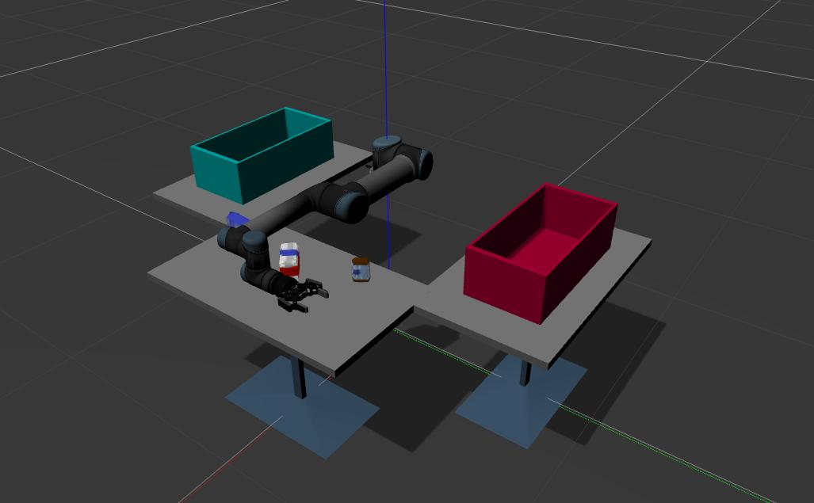
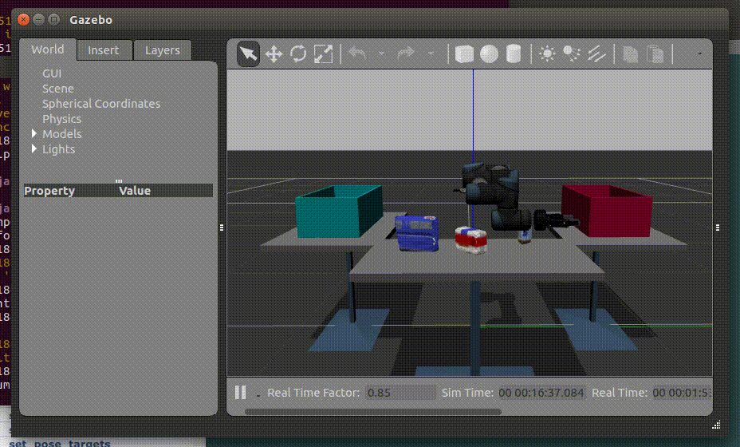
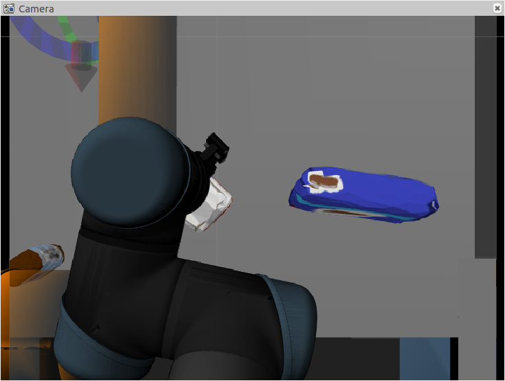
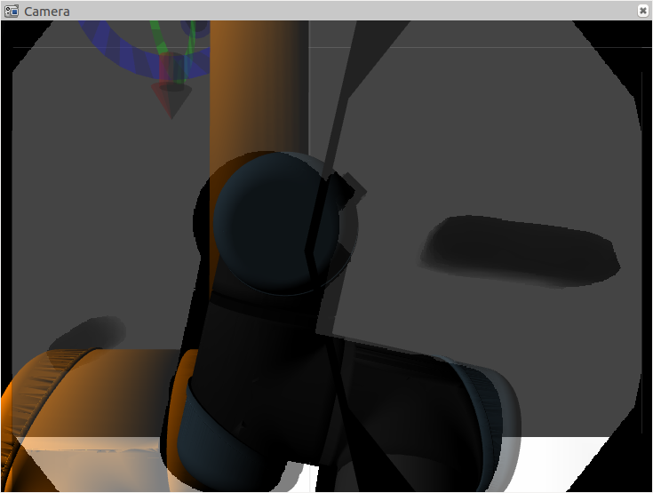
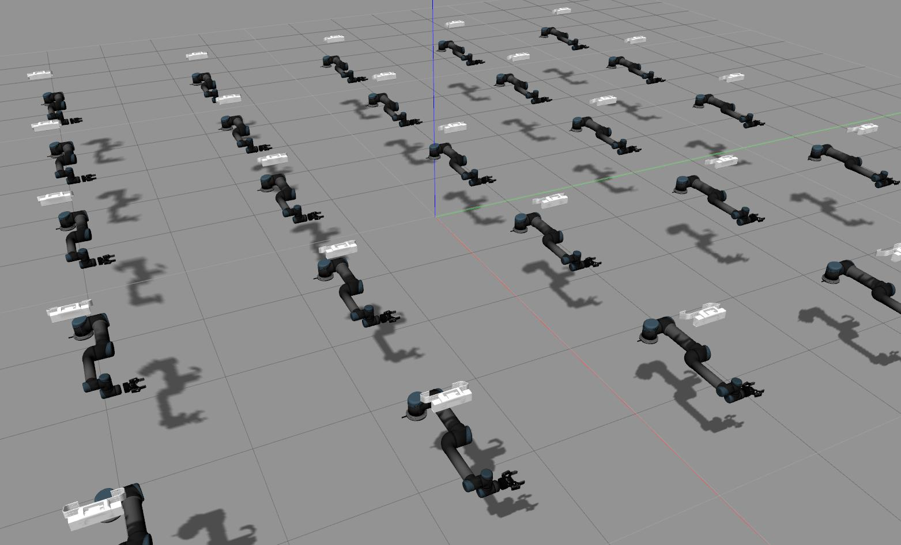

# Universal robot with robotiq hand workspace

## Build

```
source /opt/ros/kinetic/setup.bash
cd ur_ws/src
wstool update
cd ../
sudo rosdep init
rosdep update
rosdep install --from-paths src --ignore-src --rosdistro kinetic -y
catkin build
```

## Run only simulator

```
roslaunch ur_robotiq_gazebo ur_robotiq_gazebo.launch
```


## Run simul, moveit, rviz and then Grasp

The other terminal

```
roslaunch ur_robotiq_gazebo ur_robotiq_moveit_gazebo.launch
rosrun ur_robotiq_manipulation grasp_object.py
```



## Camera Images

RGB image



Depth image



## Multiple Arms



```
erb multi_ur_robotiq_gazebo.launch | roslaunch -
```
