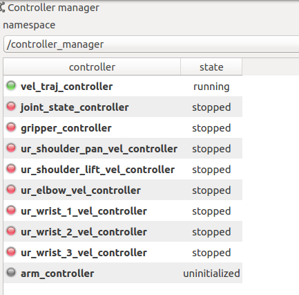

# How to launch original env
 First launch the simulator
  
  ``` 
  roslaunch ur_robotiq_gazebo gym.launch
  ```
 
 And run the training launch
  ```
  roslaunch ur_training default.launch
  ```
  
# How to launch REINFORCE algorithm
 First launch the simulator
  
  ``` 
roslaunch ur_robotiq_gazebo conveyer_gym.launch controller:=vel --screen gui:=false
  ```
 
 And load the parameters and launch python file for reset
  ```
roslaunch ur_reaching reinforcement.launch
  ```

 And start the learning algorithm 
  ```
python reinforcement_main.py 
  ```

# How to launch PPO+GAE algorithm
First launch the simulator including loading the parameters and GAZEBO Excution func
```
roslaunch ur_robotiq_gazebo conveyer_gym.launch --screen gui:=false
```

 And start the learning algorithm 
 ```
  python ppo_gae_main.py
 ```


## Conveyer GAZEBO env

First launch the gazebo and gym interface and node publishing block point.
 ```
 roslaunch ur_robotiq_gazebo conveyer_gym.launch --screen
 ```
 
 Run the RL algorithms and unpause the GAZEBO
  ```
  roslaunch ur_training default.launch
  ```
 

> Latest block's point:
``` 
rostopic echo /target_blocks_pose
```

> Total block's points:
``` 
rostopic echo /blocks_poses 
```


## Visualization

- rviz_visual_tools
```
rosrun visual_tools rviz_visual_tools_demo
```


- moveit_visual_tools
```
rosrun visual_tools moveit_visual_tools_demo
```


## Services

- _/set_velocity_controller_ ([SetBool](http://docs.ros.org/melodic/api/std_srvs/html/srv/SetBool.html))
  -  Set velocity controllers including 6 velocity controllers after stoppint velocity_controller/JointTrajectoryController
- _/set_trajectory_velocity_controller_ ([SetBool](http://docs.ros.org/melodic/api/std_srvs/html/srv/SetBool.html))
  -  Set velocity trajectory controller including Joint trajectory controllers after stopping velocity_controller/JointVelocityController
- _/stop_training_ ([SetBool](http://docs.ros.org/melodic/api/std_srvs/html/srv/SetBool.html))
  -  Stop training process
- _/start_training_ ([SetBool](http://docs.ros.org/melodic/api/std_srvs/html/srv/SetBool.html))
  -  Start training process


## Helpful function
We can check the controller manager status using following:
```
rosrun rqt_controller_manager rqt_controller_manager
```



